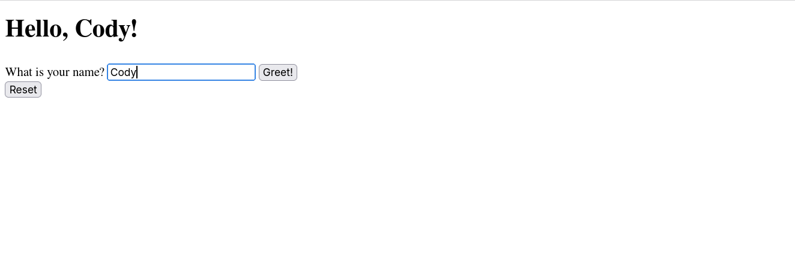

# Hello, you!

Following on from the _Hello, World!_ app, this blueprint adds user interaction by taking the user's name and greeting them.

To run: `composer install` to set up the project, `gt run` to start the server, then visit http://localhost:8080
